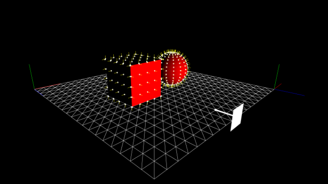
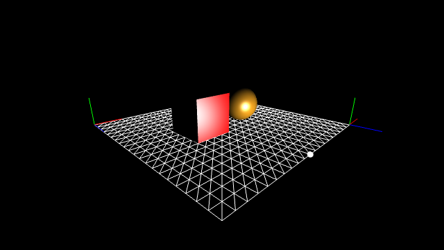
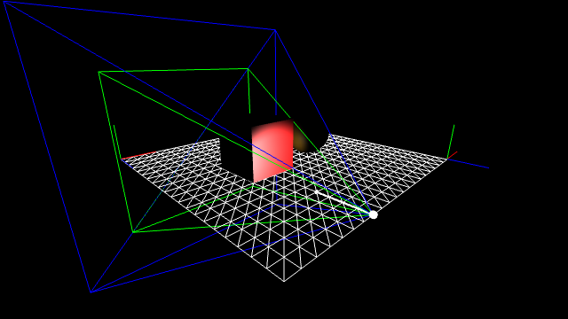

GitHub: [https://github.com/kenjiSpecial/tubugl-lighting-kyoshitsu](https://github.com/kenjiSpecial/tubugl-lighting-kyoshitsu)

### [#00 - Directional Light](./00/index.html)

[codes](https://github.com/kenjiSpecial/tubugl-lighting-kyoshitsu/tree/master/examples/00-directionalLight) | [shaders for DirectionalLight](https://github.com/kenjiSpecial/tubugl-lighting-kyoshitsu/tree/master/src/directionalLighting) | [source for DirectionalLight](https://github.com/kenjiSpecial/tubugl-lighting-kyoshitsu/blob/master/src/directionalLight.js) | [source for DirectionalLightHelper](https://github.com/kenjiSpecial/tubugl-lighting-kyoshitsu/blob/master/src/directionalLightHelper.js)

### [#01 - Point Light](./01/index.html)

[codes](https://github.com/kenjiSpecial/tubugl-lighting-kyoshitsu/tree/master/examples/01-pointLight) | [shaders for PointLight](https://github.com/kenjiSpecial/tubugl-lighting-kyoshitsu/tree/master/src/pointLighting) | [source for PointLight](https://github.com/kenjiSpecial/tubugl-lighting-kyoshitsu/blob/master/src/pointLight.js) | [source for PointLightHelper](https://github.com/kenjiSpecial/tubugl-lighting-kyoshitsu/blob/master/src/pointLightHelper.js)

### [#02 - Spot Light](./02/index.html)

[codes](https://github.com/kenjiSpecial/tubugl-lighting-kyoshitsu/tree/master/examples/02-spotLight) | [shaders for SpotLight](https://github.com/kenjiSpecial/tubugl-lighting-kyoshitsu/tree/master/src/spotLighting) | [source for SpotLight](https://github.com/kenjiSpecial/tubugl-lighting-kyoshitsu/blob/master/src/spotLight.js) | [source for SpotLightHelper](https://github.com/kenjiSpecial/tubugl-lighting-kyoshitsu/blob/master/src/spotLightHelper.js)

all examples were made with [tubugl](https://github.com/kenjiSpecial/tubugl)